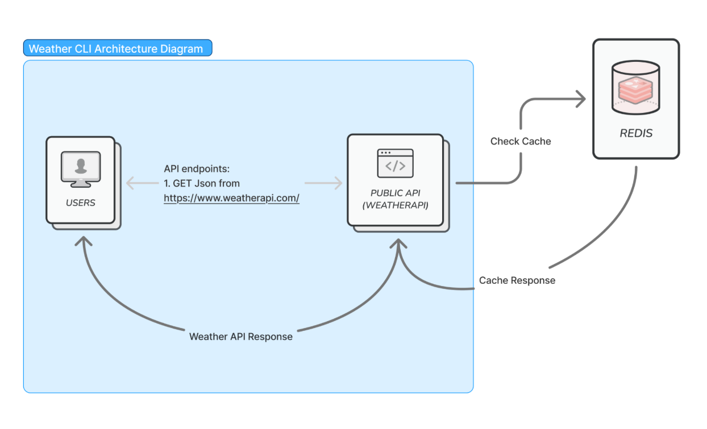

# WeatherGo

WeatherGo is a simple Go-based CLI tool that fetches current weather information for a given city using a public weather API. It uses Redis caching to reduce unnecessary API calls and improve performance.

## **What It Does**
Run the CLI with the city name

``
go run weathergo.go <city>
``

``
go run . London
``

The CLI returns current weather information about the specified city:
London, United Kingdom  48.40, Mist

## Design architecture

Setup:
1. Clone the repository:
``git clone https://github.com/yourusername/weathergo.git
cd weathergo``

2. Create an environment variable and name it WEATHER_API:
``
export WEATHER_API=your_api_key_here
``
3. Start Redis
``
redis-server
``

