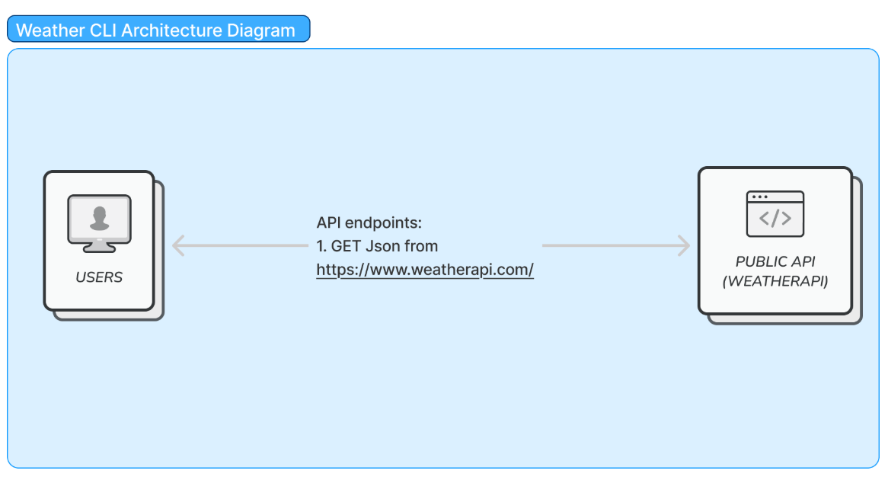

# WeatherGo

Mini-project to pull weather information from a public weather api service and
display it as a CLI

--

## **What It Does**
Run
``
go run weathergo {city}
``

It will return the following information: 
* ADD LATER *

--
## Design architecture

